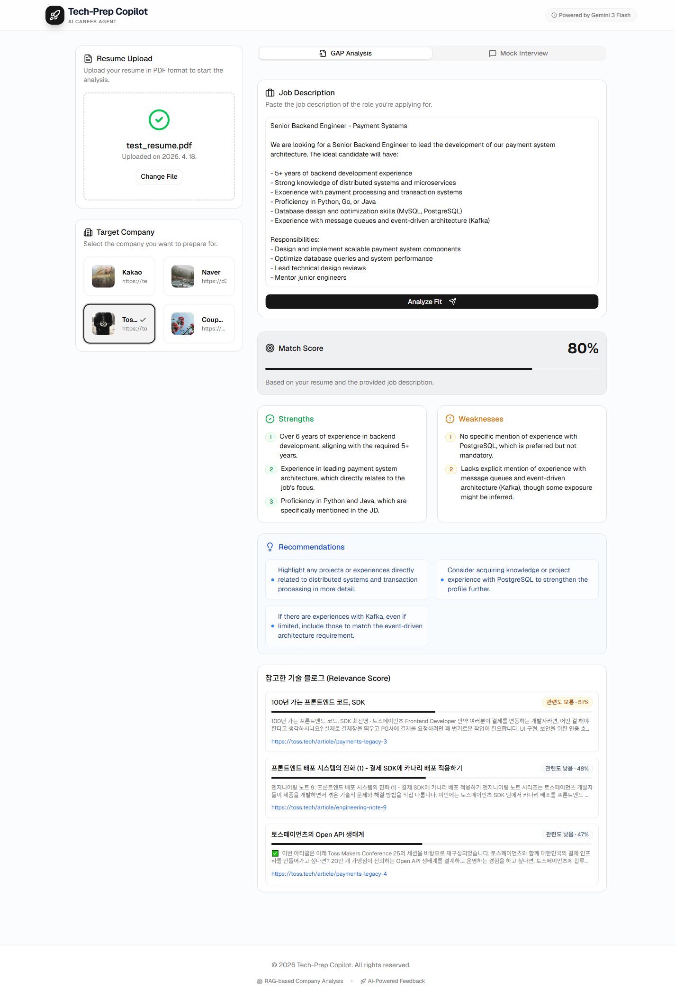

# Tech Prep Copilot

An AI copilot for developers preparing for fintech job interviews.  
Collects and vectorizes real-world articles from major Korean tech blogs (Toss, Naver D2, Kakao) to provide RAG-powered JD analysis, skill gap diagnosis, and mock interview simulations.

---

## Demo

### User Flow (GIF)


> GitHub README renders GIFs as animations (not static images).

---

## Architecture

```
Crawling Pipeline (local)               Vector DB Build (Colab T4 GPU)
┌─────────────────────┐               ┌───────────────────────────┐
│ crawler.py          │               │ build_vectorstore_colab   │
│  · Toss (static/JS) │──────────────▶│  · BAAI/bge-m3 embeddings │
│  · Naver D2 API     │               │  · ChromaDB storage        │
│  · Kakao API        │               │  · chroma_db.zip download  │
└────────┬────────────┘               └───────────────────────────┘
         │ all_tech_urls.txt                       │ chroma_db/
         ▼                                         ▼
┌─────────────────────┐               ┌───────────────────────────┐
│ run_filter_crawl.py │               │ React + Vite Frontend      │
│  · Finance keyword  │               │  · JD input / Resume upload│
│    filter           │               │  · Skill gap report        │
│  · finance_tech_    │               │  · Mock interview chat     │
│    content.json     │               │  · Persona-based interview │
└─────────────────────┘               └───────────────────────────┘
                                                   ↕ REST API
                                      ┌───────────────────────────┐
                                      │ FastAPI Backend             │
                                      │  · RAG search               │
                                      │  · Persona interview gen    │
                                      │  · Answer eval + feedback   │
                                      │  · LLM Failover (Gemini →   │
                                      │    OpenAI → Upstage)        │
                                      └───────────────────────────┘
```

---

## Quick Start

### Prerequisites
- Node.js 18+
- Python 3.11+ (Anaconda recommended)

### 1. Clone & Install Dependencies

```bash
git clone https://github.com/<your-id>/Tech-Prep-Copilot.git
cd Tech-Prep-Copilot

# Frontend
npm install

# Python backend
pip install -r requirements.txt
```

### 2. Environment Variables

```bash
cp .env.example .env
```

| Variable | Required | Description |
|----------|----------|-------------|
| `VITE_GOOGLE_API_KEY` | If using Gemini | Google AI Studio key — frontend gap analysis |
| `GOOGLE_API_KEY` | If using Gemini | Backend-only Gemini key (same value as above) |
| `OPENAI_API_KEY` | If using OpenAI | 2nd-priority LLM and frontend gap analysis fallback |
| `UPSTAGE_API_KEY` | Optional | 3rd-priority LLM ([Upstage Solar](https://developers.upstage.ai/), OpenAI-compatible API) |
| `UPSTAGE_MODEL` | Optional | Default `solar-pro` |
| `LLM_PROVIDER_ORDER` | Optional | Comma-separated try order, default `gemini,openai,upstage` |
| `LLM_TIMEOUT_SEC` | Optional | Per-provider HTTP timeout (seconds), default `60` |
| `VITE_BACKEND_URL` | Optional | FastAPI address (default: `http://localhost:8000`) |
| `TAVILY_API_KEY` | Optional | Enables realtime search augmentation |

> **Backend LLM**: Calls providers in `LLM_PROVIDER_ORDER` sequence, falling over to the next on failure or empty response.  
> At minimum, one of **Gemini** (`GOOGLE_API_KEY`), **OpenAI**, or **Upstage** must be configured for interview and RAG query expansion to work.  
> **Frontend gap analysis** uses `VITE_GOOGLE_API_KEY` or `OPENAI_API_KEY` (browser-side).

### 2.5. Vector DB Setup (Quick Start)

The repo ships with a pre-built vector database:

```bash
# Automatic: the backend auto-extracts data/chroma_db1.zip on first startup.
# Manual (if auto-extraction fails):
unzip data/chroma_db1.zip -d chroma_db
```

> **Note**: `chroma_db/` (~150MB) is git-ignored.  
> To build the vector DB from scratch, see the "Data Pipeline" section below.

### 3. Start the FastAPI Backend (required for mock interviews)

```bash
python -m uvicorn backend.main:app --reload --port 8000
```

> Without the backend, only the skill gap report works; mock interviews are disabled.  
> Check `GET /api/health` → `llm_*_configured` fields to verify which API keys are set.

### 4. Start the Frontend

```bash
npm run dev
# → http://localhost:3000
```

---

## Mock Interview Feature (v0.2)

### Persona System

Choose from 4 interviewer types. Each persona's two interviewers take turns **randomly alternating** between asking questions and giving feedback.

| Persona | Interviewer A | Interviewer B | Style |
|---------|---------------|---------------|-------|
| Strict / Kind | Na Eom-gyeok (42, Tech Lead) | Na Chin-jeol (32, Senior Dev) | Pressure-test technical depth + growth coaching |
| Business ROI | Ma Gye-san (45, Strategy VP) | Oh Net (35, Founder-turned-PM) | ROI/impact focus + business expansion |
| Infra / Scale | Kwon Scale (45, Infra Architect) | Lee An-jeong (38, Senior SRE) | Scalability stress-test + SRE mentoring |
| Algorithm | Park Al-go (38, FAANG Interviewer) | Choi Coach (33, Coding Coach) | Algorithm pressure + CS fundamentals coaching |

---

## Data Pipeline

### Step 1 — Collect Tech Blog URLs

```bash
python utils/crawler.py
# → all_tech_urls.txt
```

| Source | Method | Volume |
|--------|--------|--------|
| toss.tech | Static HTML / Playwright | ~300 articles |
| d2.naver.com | REST API | ~3,200 articles |
| tech.kakao.com | REST API | ~450 articles |

### Step 2 — Finance/Fintech Keyword Filtering

```bash
python utils/run_filter_crawl.py
# → finance_tech_content.json
```

### Step 3 — Build Vector DB (Google Colab T4 recommended)

1. Upload `utils/build_vectorstore_colab.ipynb` to Colab
2. **Runtime > Change runtime type > T4 GPU**
3. Run all cells in order, then download `chroma_db.zip`
4. Extract to project root

```
Tech-Prep-Copilot/
└── chroma_db/
    ├── chroma.sqlite3
    └── ...
```

---

## Project Structure

```
Tech-Prep-Copilot/
├── src/
│   ├── components/
│   │   ├── InterviewChat.tsx         # Mock interview (random persona alternation)
│   │   ├── PersonaSelector.tsx       # Interviewer persona selection UI
│   │   ├── GapReport.tsx             # Skill gap report
│   │   ├── JDInput.tsx               # Job description input
│   │   └── ResumeUploader.tsx        # Resume upload
│   ├── services/aiService.ts         # LLM calls (Gemini/OpenAI auto-select)
│   └── lib/store.ts                  # Zustand global state
│
├── backend/
│   ├── main.py                       # FastAPI (persona interviews, RAG, failover)
│   └── llm/failover.py              # Multi-provider LLM failover module
│
├── utils/                            # Data pipeline scripts
├── docs/                             # Analysis docs & screenshots
├── chroma_db/                        # Vector DB (git-ignored)
├── requirements.txt
├── package.json
└── .env.example
```

---

## Tech Stack

| Layer | Technology |
|-------|------------|
| Frontend | React 19, TypeScript, Vite, Tailwind CSS v4, Zustand |
| AI / LLM | Gemini 2.5 Flash Lite (primary) / OpenAI GPT-4o-mini / Upstage Solar (failover) |
| RAG | LangChain 0.3, BAAI/bge-m3, ChromaDB, multi-query expansion |
| Backend | FastAPI, Uvicorn |
| Realtime Search | Tavily API (optional) |
| Crawling | requests, BeautifulSoup4, Playwright |

---

## Verification Screenshot (PNG)


