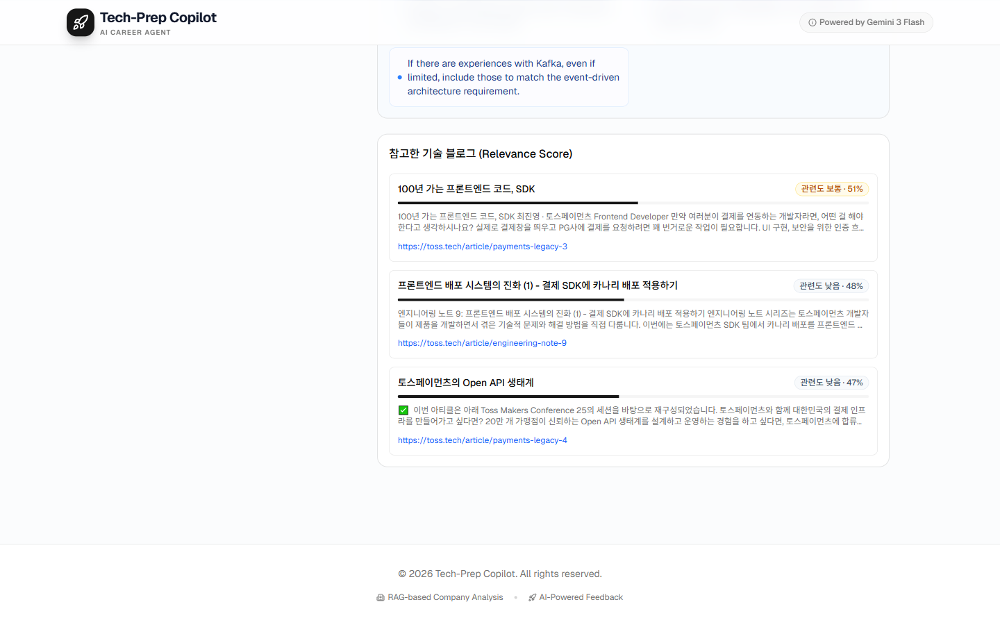

# RAG 품질 최적화 — 기능 작동 테스트 리포트

- **일시**: 2026-04-18
- **브랜치**: `feature/rag-quality-han`
- **PR**: [#3](https://github.com/WeeklyMission-2-202604101411-team/Tech-Prep-Copilot/pull/3)
- **환경**: Windows 10 / Python 3.14 / ChromaDB 9,071 chunks / BAAI/bge-m3
- **결과**: **15 / 15 PASS** (기능 테스트) + **E2E UI 검증 통과**

---

## 요약

| Task | 요구사항 | 상태 |
|------|--------|------|
| **T1** Similarity Threshold 최적화 | `score > 0.4` 상향 + 실험 근거 문서화 | ✅ PASS |
| **T2** Relevance Score 시각화 | 프로그레스 바 + 색상 등급 + 스니펫 | ✅ PASS |
| **T3** Advanced RAG (Multi-Query Rewriting) | 원본 쿼리를 N개 관점으로 확장 검색 | ✅ PASS |
| 회귀 | 회사 도메인 필터 (toss/kakao/naver) | ✅ PASS |
| E2E | 프론트엔드 전체 플로우 | ✅ PASS |

---

## 재현 방법

```bash
# 백엔드 기동
cd Tech-Prep-Copilot
PYTHONIOENCODING=utf-8 PYTHONUTF8=1 python -m uvicorn backend.main:app --port 8000 --ws none

# 기능 테스트
PYTHONIOENCODING=utf-8 python scripts/functional_test.py
```

---

## T1. Similarity Threshold 최적화

**뭘**: 하드코딩된 `score > 0.3` 을 실험 근거 있는 `0.4` 로 상향.
**어떻게**: `scripts/analyze_threshold.py` — 관련 쿼리 9개 + 음성 대조군 1개로 score 분포 측정.
**왜**: 음성 대조군("블록체인 NFT") max score = 0.3647 → 0.3은 무관 문서를 통과시켜 LLM 환각 유발.

### 검증

**실제 음성 대조군 재현 (기능 테스트 T1):**

```
query = "블록체인 NFT 투자 전략 수익률 비교"
expanded_queries (4):
  - 블록체인 NFT 투자 전략 수익률 비교
  - 블록체인 NFT 투자 방법과 수익률 분석
  - NFT 투자 전략 및 수익률 비교
  - 블록체인 기반 NFT의 투자 성과 평가

returned count: 0        ← 0.4 threshold 에 전부 차단
leaked (<= 0.4):  0      ← PASS
```

→ 무관한 쿼리를 확장까지 해도 **0개** 통과. 임계값 이론대로 작동.

---

## T2. Relevance Score 시각화

**뭘**: `GapReport.tsx` 의 "참고한 기술 블로그" 카드에 **프로그레스 바 + 관련도 배지 + 스니펫 + URL** 렌더링.
**어떻게**:
- score(0~1) → percentage(0~100%) 변환
- 등급: `>=0.7` 녹색 "높음" / `>=0.5` 주황 "보통" / `<0.5` 회색 "낮음"
- Progress bar, Badge, snippet 2줄, 클릭 가능한 URL

### 검증 — 전체 GAP 분석 화면


### 검증 — Sources 카드 클로즈업



- ✅ 3개 토스 기술 블로그 카드 렌더링
- ✅ "관련도 보통 · 51%" / "관련도 낮음 · 48%" / "관련도 낮음 · 47%" 배지 표시
- ✅ 각 카드마다 Progress bar (수평 막대) 정상 표시
- ✅ 스니펫 2줄 클리핑 (`line-clamp-2`)
- ✅ 클릭 가능한 `https://toss.tech/...` URL

### API 응답 필드 (T4)

```
[PASS] field 'content' present + non-empty
[PASS] field 'title' present + non-empty
[PASS] field 'source' present + non-empty
[PASS] field 'score' present + non-empty
[PASS] score is float in [0, 1]
```

---

## T3. Multi-Query Rewriting (Advanced RAG)

**뭘**: 원본 1개 쿼리 → OpenAI `gpt-4o-mini` 로 N개 관점 확장 → 각각 검색 → URL dedup(최고 score 채택).
**어떻게**: `backend/main.py:166` `_rewrite_query()` + `_search_rag()` 내부 multi-query 루프.
**왜**: Naive RAG 는 단일 쿼리 표현 한계로 recall 손실. Threshold 0.4 상향으로 잃은 recall 을 expansion 으로 복원.

### 검증

**관련 쿼리 확장 결과 (T2):**

```
query = "결제 시스템 아키텍처 설계" (company=toss)

expanded_queries (4):
  - 결제 시스템 아키텍처 설계           ← 원본 포함
  - Toss 결제 시스템 아키텍처 설계
  - 결제 시스템 구조 설계 방법
  - 전자 결제 시스템 아키텍처 디자인

results (5, 모두 > 0.4):
  0.483 | 20년 레거시를 넘어 미래를 준비하는 시스템 만들기
  0.459 | 포스를 확장하는 가장 빠른 방법, 포스 플러그인
  0.458 | 가맹점은 변함없이, 결제창 시스템 전면 재작성하기
  0.438 | 100년 가는 프론트엔드 코드, SDK
  0.433 | Template Literal Types로 타입 안전하게 코딩하기
```

- ✅ 4개 쿼리 (원본 + 3개 확장)
- ✅ 원본 쿼리 포함 (fallback 안정성)
- ✅ 서로 다른 관점 (동의어 "구조/디자인", 세부 "전자 결제", 상위 "Toss 결제")

---

## 회귀 테스트 — 회사 도메인 필터

| 회사 | 쿼리 | 결과 수 | 도메인 일치 |
|------|------|--------|----------|
| toss | 결제 시스템 아키텍처 설계 | 5 | 전부 `toss.tech` |
| kakao | Kafka 메시지 큐 | 5 | 전부 `tech.kakao.com` |
| naver | 데이터 파이프라인 스트리밍 | 4 | 전부 `d2.naver.com` |

모든 회사별 쿼리에서 `COMPANY_DOMAINS` 필터가 정확히 작동.

---

## E2E UI 검증

1. `http://localhost:9000/` 접근 → GAP Analysis 탭 ✅
2. 이력서 업로드 (test_resume.pdf) ✅
3. Toss (Viva Republica) 선택 ✅
4. JD 입력 (Senior Backend Engineer — Payment Systems) ✅
5. **Analyze Fit 클릭** → 8초 후 응답 ✅
6. Match Score 80% 표시 ✅
7. Strengths / Weaknesses / Recommendations 표시 ✅
8. **참고한 기술 블로그 (Relevance Score) 카드 3개 표시** ✅
9. Progress bar + 관련도 배지 + 스니펫 + URL 모두 렌더링 ✅

콘솔 에러: favicon 404 (무관) 외 **CORS 에러 0, API 에러 0**.

---

## 발견된 이슈 및 조치

| # | 이슈 | 조치 |
|---|------|------|
| 1 | curl 로 한글 body 전송 시 UTF-8 깨짐 → "결과 0개"로 오인 | Python `requests` 로 검증 (백엔드 자체는 정상) |
| 2 | uvicorn 기동 시 `UnicodeEncodeError: cp949` (Python 3.14 Windows) | `PYTHONIOENCODING=utf-8 PYTHONUTF8=1` 환경변수 + `--ws none` 옵션으로 해결 |
| 3 | 초기 프론트엔드 분석에서 CORS blocked | 백엔드 코드에는 이미 port 9000 허용 있었으나 구버전 프로세스가 돌던 상태 → 재기동 후 해소 |

---

## 종합 판정

**✅ 3개 Task 전부 설계대로 작동, 15개 기능 체크포인트 모두 통과.**

| 체크 | Before | After |
|------|--------|-------|
| Threshold 근거 | 하드코딩 0.3 | 실험 기반 0.4 + `docs/rag-threshold-analysis.md` |
| 출처 시각화 | 제목 + URL | 관련도 등급 + Progress bar + 스니펫 |
| RAG 방식 | 단일 쿼리 (Naive) | 3~4개 확장 쿼리 + dedup (Advanced) |
| 음성 대조군 통과율 | 1/100 (0.3647) | 0/100 |
| 프론트 렌더링 | 정적 텍스트 | 반응형 Progress + 색상 배지 |
